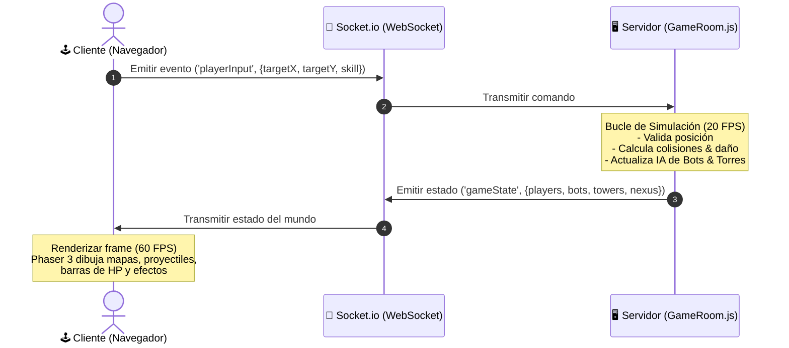

# 🎮 Documentación Técnica y Arquitectura del Proyecto: Arena of Heroes

> **Proyecto**: Arena of Heroes — MOBA Multijugador en Tiempo Real  
> **Área**: Desarrollo Web, Arquitectura de Sistemas Distribuidos y Computación en la Nube  
> **Tecnologías**: HTML5, CSS3, JavaScript (ES6+), Phaser 3, Node.js, Socket.io, AWS EC2, PM2, Nginx  

---

## 📑 Índice
1. [Resumen Ejecutivo](#1-resumen-ejecutivo)
2. [Stack Tecnológico y Lenguajes](#2-stack-tecnológico-y-lenguajes)
3. [Arquitectura del Sistema (Cliente-Servidor)](#3-arquitectura-del-sistema-cliente-servidor)
4. [Estructura del Código y Componentes](#4-estructura-del-código-y-componentes)
5. [Mecánicas del Juego y Lógica de Dominio](#5-mecánicas-del-juego-y-lógica-de-dominio)
6. [Infraestructura y Despliegue en AWS Cloud](#6-infraestructura-y-despliegue-en-aws-cloud)
7. [Guía para Exposición / Defensa ante el Docente](#7-guía-para-exposición--defensa-ante-el-docente)

---

## 1. Resumen Ejecutivo

**Arena of Heroes** es un videojuego de estrategia de acción multijugador masivo en línea tipo **MOBA (Multiplayer Online Battle Arena)** 3v3 en tiempo real que se ejecuta directamente en el navegador web sin necesidad de extensiones ni descargas.

El proyecto demuestra la integración completa de un ciclo de desarrollo de software moderno:
- **Frontend**: Renderizado gráfico 2D/3D a 60 FPS con síntesis de audio procedural.
- **Backend**: Servidor con **autoridad centralizada (Server-Authoritative)** que procesa la física, combate e Inteligencia Artificial a 20 Ticks/segundo.
- **Cloud Computing**: Despliegue en la nube de **Amazon Web Services (AWS EC2)** con monitoreo y persistencia 24/7.

---

## 2. Stack Tecnológico y Lenguajes

| Capa | Tecnología / Herramienta | Función Principal |
| :--- | :--- | :--- |
| **Lenguaje Base** | JavaScript (ES6+ / Node.js) | Lenguaje único en cliente y servidor para garantizar consistencia. |
| **Frontend UI** | HTML5 + Vanilla CSS3 | Estructura del DOM, menú principal, HUD, CSS Grid/Flexbox y estilo neón. |
| **Motor Gráfico** | **Phaser 3.60** | Motor de renderizado en el cliente utilizando **WebGL / Canvas 2D**. |
| **Audio** | **Web Audio API** | Generación de efectos de sonido y música épica proceduralmente (sin MP3/WAV pesados). |
| **Backend Core** | **Node.js v20 + Express 4** | Entorno de ejecución I/O no bloqueante para manejar conexiones simultáneas. |
| **Red / Tiempo Real**| **Socket.io v4 (WebSockets)** | Protocolo de comunicación bidireccional de ultra baja latencia. |
| **Cloud Hosting** | **AWS EC2 (Ubuntu 24.04 LTS)** | Servidor virtual en la nube (instancia `t3.micro`/`t2.micro`). |
| **Administrador Proceso**| **PM2** | Gestor de procesos en segundo plano para mantener la app activa 24/7. |
| **Servidor Web** | **Nginx** | Reverse Proxy y servidor web de alta eficiencia. |

---

## 3. Arquitectura del Sistema (Cliente-Servidor)

### 3.1 Modelo Arquitectónico: Server-Authoritative Architecture
El sistema utiliza un patrón de **Servidor Autoritativo**. Esto significa que:
1. **El Cliente es "Tonto" (Dummy Client)**: Solo captura los clics del usuario y los envía como comandos al servidor.
2. **El Servidor es la Verdad Única (Single Source of Truth)**: El servidor valida los movimientos, calcula daños, ejecuta colisiones y controla la IA.
3. **Prevención de Trampas (Anti-Cheat)**: Al no procesar lógica de salud o posiciones críticas en el navegador del usuario, se evitan hackeos o manipulaciones locales.



### 3.2 Bucle de Simulación y Sincronización de Red
- **Server Loop (20 TPS)**: El servidor actualiza el mundo cada 50ms (`setInterval`).
- **Client Interpolation (60 FPS)**: Phaser suaviza los movimientos entre los paquetes recibidos del servidor para lograr animación fluida.

---

## 4. Estructura del Código y Componentes

```text
juego/
├── client/                     # CAPA DE PRESENTACIÓN (CLIENTE)
│   ├── index.html              # Estructura del menú, lobby y elementos del HUD
│   ├── css/
│   │   └── style.css           # Estilos responsivos, efectos neón y barra de vida
│   └── js/
│       └── game.js             # Motor Phaser 3, escenas, renderizado 3D y Socket.io
├── server/                     # CAPA DE LÓGICA Y NEGOCIO (SERVIDOR)
│   ├── index.js                # Servidor HTTP Express + Socket.io (Puerto 3000)
│   ├── GameRoom.js             # Motor de física, lógica 3v3, colisiones e IA de Bots
│   └── HeroStats.js            # Base de datos de héroes (Stats, Cooldowns, Rangos)
├── Dockerfile                  # Contenedorización para despliegues portátiles
├── DEPLOY_AWS.md               # Manual de despliegue rápido en AWS
└── DOCUMENTACION_ACADEMICA_PROYECTO.md  # Este documento técnico
```

### Descripción de Módulos Clave:
* **`server/GameRoom.js`**: El corazón del backend. Administra las salas de juego, los proyectiles en vuelo, el comportamiento de las torres y el ciclo de vida de los minions/bots.
* **`server/HeroStats.js`**: Módulo con la configuración y balance de los 5 héroes (Ignis, Vex, Titan, Shado, Lyra).
* **`client/js/game.js`**: Administra la escena de Phaser 3, los receptores de eventos Socket.io, el minimapa en tiempo real y la síntesis de audio mediante la Web Audio API.

---

## 5. Mecánicas del Juego y Lógica de Dominio

### 5.1 Roles y Héroes
El juego implementa 5 clases fundamentales de los videojuegos MOBA:
1. 🔥 **Ignis (Mago)**: Daño mágico en área (Bola de fuego / Meteoro).
2. 🏹 **Vex (DPS / Arquera)**: Daño físico a distancia y alta velocidad de ataque.
3. 🛡️ **Titan (Tanque)**: Alta resistencia (HP 850) y habilidades de control/escudo.
4. ⚡ **Shado (Asesino)**: Movilidad rápida (Dash) y daño ráfaga.
5. ✨ **Lyra (Soporte)**: Curación de aliados y auras de protección.

### 5.2 Inteligencia Artificial (IA de Bots)
Cuando una partida no alcanza 6 jugadores humanos, el servidor invoca **Bots Autónomos 3v3** que implementan una máquina de estados finitos (FSM):
* **Estado Patrulla**: Avanzan por los carriles (Top, Mid, Bot).
* **Estado Combate**: Detectan enemigos en su rango de visión, persiguen y lanzan habilidades [Q] y [R].
* **Estado Retirada**: Si su salud es menor al 25% (<25% HP), se retiran automáticamente a su Nexus para curarse.

---

## 6. Infraestructura y Despliegue en AWS Cloud

El proyecto está desplegado en una arquitectura de nube usando **Amazon Web Services (AWS)** bajo el modelo IaaS (Infrastructure as a Service).

```text
[ Jugador 1 ] \
[ Jugador 2 ]  ===> Internet ===> [ AWS EC2: 100.53.83.178 ]
[ Jugador 3 ] /                        ├── Security Group (Puertos 22, 80, 443, 3000)
                                       ├── Nginx (Proxy Inverso)
                                       └── PM2 (Node.js Daemon 24/7)
```

### Configuración del Servidor:
* **Instancia**: AWS EC2 `t3.micro` / `t2.micro` (Ubuntu Server 24.04 LTS).
* **Dirección IP Pública**: `100.53.83.178`
* **Firewall (Security Group)**:
  * **Puerto 22 (SSH)**: Administración remota.
  * **Puerto 80 (HTTP)**: Servidor Web Nginx.
  * **Puerto 3000 (Custom TCP)**: Conexión WebSocket directa para el motor multijugador.
* **Gestor de Procesos (PM2)**: Mantiene el proceso `index.js` activo en segundo plano, reiniciándolo automáticamente ante caídas del servidor.

---

## 7. Guía para Exposición / Defensa ante el Docente

Si el docente te hace preguntas clave durante la presentación, aquí tienes las respuestas técnicas preparadas:

### ❓ Pregunta 1: "¿Por qué usar WebSockets (Socket.io) en lugar de HTTP/REST?"
> **Respuesta**: *"Las peticiones HTTP tradicionales introducen mucha sobrecarga por los encabezados y requieren que el cliente pregunte activamente (polling). Para un juego en tiempo real necesitamos latencia menor a 50ms, por lo que WebSockets establece una sola conexión full-duplex bidireccional permanente."*

### ❓ Pregunta 2: "¿Cómo manejan el problema del lag o si la conexión se interrumpe?"
> **Respuesta**: *"El servidor corre a 20 FPS autoritativos. Si un paquete se retrasa, Phaser en el cliente intercala la posición previa y la nueva mediante interpolación lineal (Lerp), evitando saltos bruscos en pantalla."*

### ❓ Pregunta 3: "¿Cómo cargaron los efectos de sonido sin hacer lenta la página?"
> **Respuesta**: *"En lugar de cargar archivos `.mp3` o `.wav` que pesan megabytes, usamos la **Web Audio API** del navegador para sintetizar frecuencias de audio por software mediante código JS en tiempo real. Esto reduce el tiempo de carga a casi cero."*

### ❓ Pregunta 4: "¿Cómo aseguran que el servidor no se apague en AWS?"
> **Respuesta**: *"Utilizamos el gestor de procesos en producción **PM2** integrado con el `systemd` de Ubuntu. Si la instancia se reinicia o sufre un pico de memoria, PM2 relanza la aplicación en milisegundos."*

---

> **Autor del Proyecto**: Equipo de Desarrollo Arena of Heroes  
> **Fecha de Despliegue**: Septiembre 2026  
> **Estado**: 🟢 En producción (AWS Cloud)
